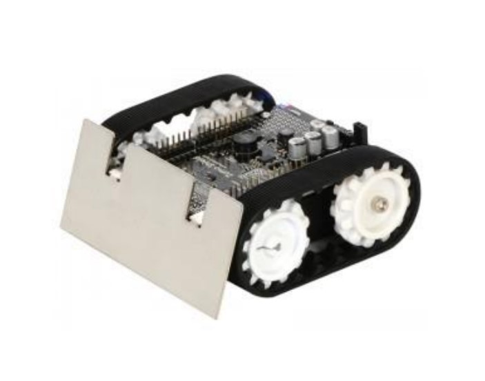

  

# ZUMO-COOPERATION-(SWARM)-
Zumo cooperate robots with ordering from one of them.

Academic project on Design Laboratory subject, during third year of Electronics on University of Science and Technology in Cracow. 
The main goal of this project is obtainment couple of robots with one of them ordering to others. This one will know others localization and it will be able to manipulate with the others by orders. 

Authors: Norbert Ligas, Krzysztof Pokora
